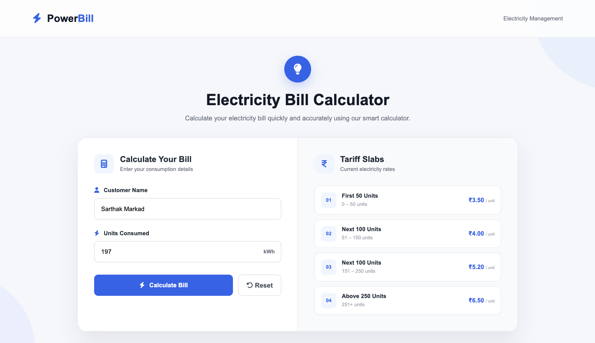
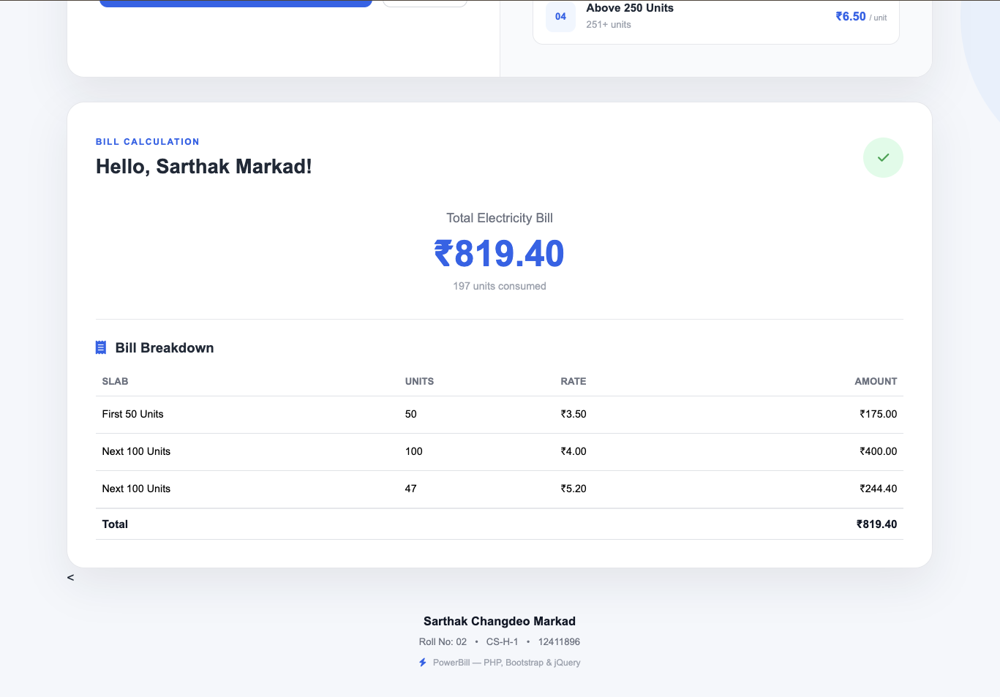
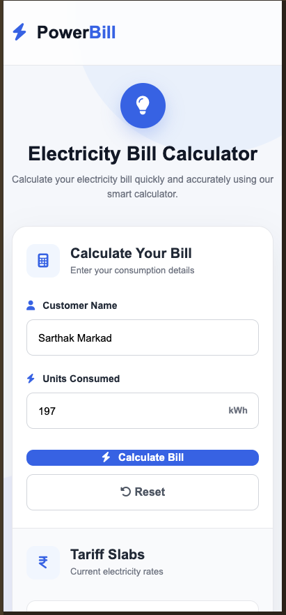

# ⚡ Electricity Bill Calculator

A responsive **Electricity Bill Calculator** developed using **PHP, Bootstrap and jQuery**. The application calculates the electricity bill based on the number of units consumed using predefined tariff slabs.

## 📌 Project Overview

This project was developed as a web development practical to demonstrate the use of **PHP for server-side processing**, **Bootstrap for responsive UI design**, and **jQuery for client-side form validation**.

The user enters their name and electricity consumption in units. The application calculates the total electricity bill according to the given tariff structure and displays a detailed bill breakdown.

## ✨ Features

* ⚡ Electricity bill calculation using PHP
* 👤 Customer name input
* 🔢 Units consumed input
* 💰 Automatic bill calculation
* 📊 Detailed bill breakdown
* 📱 Responsive design using Bootstrap
* ✅ Client-side form validation using jQuery
* 🔒 Server-side validation using PHP
* 🔄 Reset button
* 🎨 Modern and responsive user interface
* 📋 Displays tariff slabs

## 💰 Electricity Tariff

| Units Consumed           |       Rate |
| ------------------------ | ---------: |
| First 50 units           | ₹3.50/unit |
| Next 100 units (51–150)  | ₹4.00/unit |
| Next 100 units (151–250) | ₹5.20/unit |
| Above 250 units          | ₹6.50/unit |

### Example

For **300 units**:

```text
First 50 units     = 50 × ₹3.50 = ₹175.00
Next 100 units     = 100 × ₹4.00 = ₹400.00
Next 100 units     = 100 × ₹5.20 = ₹520.00
Above 250 units    = 50 × ₹6.50 = ₹325.00
-----------------------------------------
Total Bill                       ₹1420.00
```

## 🛠️ Technologies Used

* **PHP** – Server-side processing and bill calculation
* **HTML5** – Website structure
* **CSS3** – Custom styling
* **Bootstrap 5** – Responsive design and UI components
* **jQuery** – Client-side validation and interaction
* **Font Awesome** – Icons
* **XAMPP** – Local PHP development environment

## 📂 Project Structure

```text
electricity-bill/
│
├── index.php
│
├── css/
│   └── style.css
│
├── js/
│   └── script.js
│
├── screenshots/
│   ├── homepage.png
│   ├── bill-result.png
│   └── mobile-view.png
│
└── README.md
```

## ⚙️ How to Run the Project

### 1. Install XAMPP

Install XAMPP and start the **Apache** server.

### 2. Copy the project

Place the project folder inside:

```text
C:\xampp\htdocs\
```

The final path should be:

```text
C:\xampp\htdocs\electricity-bill
```

### 3. Start the application

Open your browser and visit:

```text
http://localhost/electricity-bill/
```

### 4. Calculate the bill

Enter:

* Customer name
* Units consumed

Then click **Calculate Bill**.

## 🖥️ Screenshots

### Homepage



### Bill Calculation Result



### Mobile Responsive View



## 🧪 Sample Test Cases

| Units | Expected Bill |
| ----: | ------------: |
|    20 |        ₹70.00 |
|    50 |       ₹175.00 |
|   100 |       ₹375.00 |
|   150 |       ₹575.00 |
|   200 |       ₹835.00 |
|   250 |      ₹1095.00 |
|   300 |      ₹1420.00 |

## 👨‍💻 Author

**Sarthak Changdeo Markad**

**Roll No:** 02
**Class:** CS-H-1
**PRN:** 12411896

## 📚 Academic Practical

This project demonstrates the integration of:

```text
HTML + CSS + Bootstrap
          ↓
        jQuery
          ↓
         PHP
          ↓
Electricity Bill Calculation
```

---

⭐ If you find this project useful, feel free to explore the source code.
